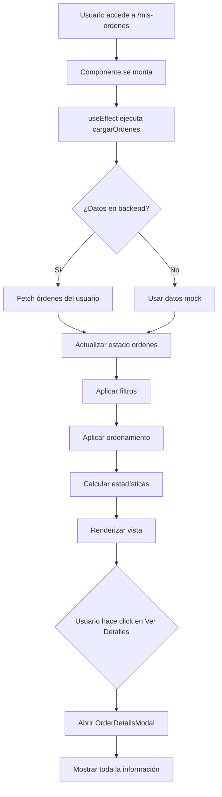

# 📋 Mis Órdenes - Documentación Completa

## Descripción General

La página **"Mis Órdenes"** proporciona un historial completo y detallado de todos los pedidos realizados por el usuario, con capacidades de filtrado, ordenamiento, estadísticas y seguimiento en tiempo real del estado de cada orden.

---

## 🎯 Características Principales

### 1. **Historial Completo de Órdenes**
- ✅ Visualización de todas las órdenes del usuario
- ✅ Información detallada de cada pedido
- ✅ Estado actual y seguimiento
- ✅ Fechas de orden y entrega

### 2. **Sistema de Filtrado Avanzado**
- 🔍 **Por Estado:**
  - Pendientes
  - Preparando
  - Listo
  - Entregadas
  - Canceladas
  
- 🚚 **Por Tipo de Servicio:**
  - A Domicilio
  - Para Recoger
  - En Mesa

### 3. **Ordenamiento Flexible**
- 📅 Más Recientes
- 📅 Más Antiguos
- 💰 Mayor Total
- 💰 Menor Total

### 4. **Estadísticas en Tiempo Real**
- 📊 Total de órdenes
- ⏳ Órdenes pendientes
- ✅ Órdenes completadas
- 💵 Total gastado

### 5. **Modal de Detalles Completos**
- 📝 Línea de tiempo del pedido
- 📍 Información de entrega
- 🍽️ Lista de productos
- 💰 Desglose financiero
- 📄 Opción de descarga de recibo

---

## 📁 Estructura de Archivos

```
src/
├── components/
│   ├── OrderCard.tsx              ⭐ NUEVO - Card de orden individual
│   └── OrderDetailsModal.tsx      ⭐ NUEVO - Modal con detalles completos
├── pages/
│   └── MisOrdenesPage.tsx         ⭐ NUEVO - Página principal
└── App.css                        ✏️ MODIFICADO - Estilos para órdenes
```

---

## 🔧 Componentes Detallados

### 1. OrderCard Component

Componente reutilizable que muestra información resumida de una orden.

**Props:**
```typescript
interface OrderCardProps {
  orden: Orden
  onVerDetalles: (orden: Orden) => void
}
```

**Características:**
- 🎨 Diseño visual atractivo
- 📊 Barra de progreso según estado
- 🏷️ Badges de estado y tipo de servicio
- 📅 Fechas formateadas
- 💰 Total destacado
- 🖱️ Hover effects

**Código de ejemplo:**
```typescript
<OrderCard 
  orden={miOrden}
  onVerDetalles={(orden) => setOrdenSeleccionada(orden)}
/>
```

---

### 2. OrderDetailsModal Component

Modal que muestra todos los detalles de una orden específica.

**Props:**
```typescript
interface OrderDetailsModalProps {
  orden: Orden | null
  onClose: () => void
}
```

**Secciones del Modal:**

#### 📌 Header
- Número de orden
- Botón de cierre

#### 🎯 Estado y Tipo
- Card con estado actual (con badge colorido)
- Card con tipo de servicio (con icono)

#### 📈 Línea de Tiempo
Visual timeline mostrando el progreso:
```
✅ Orden Recibida
🍳 En Preparación
✅ Pedido Listo
🚚 Entregado
```

#### 📍 Información de Entrega
- Dirección (para domicilio)
- Teléfono de contacto
- Número de mesa (para servicio en mesa)
- Notas especiales

#### 🍽️ Productos Ordenados
Tabla con:
- Nombre del producto
- Cantidad
- Precio unitario
- Subtotal

#### 💰 Resumen de Pago
- Subtotal
- Impuestos (IVA 16%)
- **Total** (destacado)

#### 🔧 Acciones
- Cancelar orden (solo si está pendiente)
- Descargar recibo
- Cerrar modal

**Código de ejemplo:**
```typescript
<OrderDetailsModal
  orden={ordenSeleccionada}
  onClose={() => setOrdenSeleccionada(null)}
/>
```

---

### 3. MisOrdenesPage Component

Página principal que integra todo el sistema de órdenes.

**Estado Local:**
```typescript
const [ordenes, setOrdenes] = useState<Orden[]>([])
const [loading, setLoading] = useState(true)
const [filtroEstado, setFiltroEstado] = useState<EstadoOrden | 'todas'>('todas')
const [filtroTipo, setFiltroTipo] = useState<TipoServicio | 'todos'>('todos')
const [ordenSeleccionada, setOrdenSeleccionada] = useState<Orden | null>(null)
const [ordenamiento, setOrdenamiento] = useState<'reciente' | 'antiguo' | 'mayor' | 'menor'>('reciente')
```

**Funciones Principales:**

#### `cargarOrdenes()`
Obtiene las órdenes del usuario desde el backend (actualmente usa datos mock).

```typescript
const cargarOrdenes = async () => {
  setLoading(true)
  try {
    // TODO: Llamada real al backend
    const response = await fetch(`/api/ordenes/usuario/${usuario.id}`)
    const data = await response.json()
    setOrdenes(data.ordenes)
  } catch (error) {
    console.error('Error:', error)
  } finally {
    setLoading(false)
  }
}
```

#### `ordenesFiltradas`
Aplica filtros y ordenamiento a las órdenes.

```typescript
const ordenesFiltradas = ordenes
  .filter(orden => {
    // Filtros por estado y tipo
    if (filtroEstado !== 'todas' && orden.estado !== filtroEstado) return false
    if (filtroTipo !== 'todos' && orden.tipo_servicio !== filtroTipo) return false
    return true
  })
  .sort((a, b) => {
    // Ordenamiento según criterio seleccionado
    switch (ordenamiento) {
      case 'reciente': return new Date(b.fecha_orden) - new Date(a.fecha_orden)
      case 'antiguo': return new Date(a.fecha_orden) - new Date(b.fecha_orden)
      case 'mayor': return b.total - a.total
      case 'menor': return a.total - b.total
    }
  })
```

#### `estadisticas`
Calcula métricas en tiempo real.

```typescript
const estadisticas = {
  total: ordenes.length,
  pendientes: ordenes.filter(o => o.estado === 'pendiente').length,
  preparando: ordenes.filter(o => o.estado === 'preparando').length,
  listos: ordenes.filter(o => o.estado === 'listo').length,
  entregados: ordenes.filter(o => o.estado === 'entregado').length,
  cancelados: ordenes.filter(o => o.estado === 'cancelado').length,
  totalGastado: ordenes
    .filter(o => o.estado !== 'cancelado')
    .reduce((sum, o) => sum + o.total, 0),
}
```

---

## 🎨 Diseño y UX

### Paleta de Colores por Estado

| Estado | Color | Hex | Uso |
|--------|-------|-----|-----|
| Pendiente | Amarillo | `#ffc107` | Warning |
| Preparando | Cyan | `#0dcaf0` | Info |
| Listo | Azul | `#0d6efd` | Primary |
| Entregado | Verde | `#28a745` | Success |
| Cancelado | Rojo | `#dc3545` | Danger |

### Iconografía

| Tipo | Icono | Descripción |
|------|-------|-------------|
| Domicilio | `fa-motorcycle` | Entrega en motocicleta |
| Mesa | `fa-chair` | Servicio en mesa |
| Recoger | `fa-shopping-bag` | Para llevar |
| Pendiente | `fa-clock` | En espera |
| Preparando | `fa-utensils` | Cocinando |
| Listo | `fa-check` | Completado |
| Entregado | `fa-check-double` | Entregado |
| Cancelado | `fa-times-circle` | Cancelado |

### Animaciones

#### 1. **Slide In Left** (Lista de órdenes)
```css
@keyframes slideInLeft {
  from {
    opacity: 0;
    transform: translateX(-20px);
  }
  to {
    opacity: 1;
    transform: translateX(0);
  }
}
```

#### 2. **Zoom In** (Modal)
```css
@keyframes zoomIn {
  from {
    transform: scale(0.9);
    opacity: 0;
  }
  to {
    transform: scale(1);
    opacity: 1;
  }
}
```

#### 3. **Pulse** (Carga)
```css
@keyframes pulse {
  0%, 100% { opacity: 1; }
  50% { opacity: 0.5; }
}
```

### Responsive Design

**Breakpoints:**
- Mobile: < 768px
- Tablet: 768px - 992px
- Desktop: > 992px

**Ajustes Mobile:**
```css
@media (max-width: 768px) {
  .timeline { padding-left: 1.5rem; }
  .timeline-item i { width: 16px; height: 16px; }
  .order-card { border-left-width: 3px; }
}
```

---

## 🔄 Flujo de Datos



---

## 📊 Estructura de Datos

### Tipo Orden

```typescript
interface Orden {
  id: number                      // Identificador único
  usuario_id: number              // ID del usuario que ordenó
  mesa_id?: number                // ID de mesa (opcional)
  estado: EstadoOrden             // Estado actual
  tipo_servicio: TipoServicio     // Tipo de servicio
  subtotal: number                // Subtotal sin impuestos
  impuestos: number               // IVA (16%)
  total: number                   // Total a pagar
  direccion_entrega?: string      // Dirección (para domicilio)
  telefono_contacto?: string      // Teléfono de contacto
  notas_especiales?: string       // Notas del cliente
  fecha_orden: string             // Fecha/hora de la orden
  fecha_entrega_estimada?: string // Fecha estimada de entrega
  empleado_asignado_id?: number   // ID del empleado asignado
}
```

### Estados Posibles

```typescript
type EstadoOrden = 
  | 'pendiente'    // Orden recibida, esperando confirmación
  | 'preparando'   // Orden en preparación
  | 'listo'        // Orden lista para recoger/entregar
  | 'entregado'    // Orden completada
  | 'cancelado'    // Orden cancelada
```

### Tipos de Servicio

```typescript
type TipoServicio = 
  | 'mesa'        // Servicio en mesa del restaurante
  | 'domicilio'   // Entrega a domicilio
  | 'recoger'     // Para recoger en el restaurante
```

---

## 🔌 Integración con Backend

### Endpoints Requeridos (TODO)

#### 1. **GET /api/ordenes/usuario/:id**
Obtener todas las órdenes de un usuario.

**Request:**
```http
GET /api/ordenes/usuario/123
Authorization: Bearer {token}
```

**Response:**
```json
{
  "success": true,
  "data": {
    "ordenes": [
      {
        "id": 1001,
        "usuario_id": 123,
        "estado": "entregado",
        "tipo_servicio": "domicilio",
        "subtotal": 450.00,
        "impuestos": 72.00,
        "total": 522.00,
        "direccion_entrega": "Av. Reforma 123",
        "fecha_orden": "2025-10-01T14:30:00",
        "productos": [...]
      }
    ],
    "total": 6
  }
}
```

#### 2. **GET /api/ordenes/:id**
Obtener detalles completos de una orden específica.

**Request:**
```http
GET /api/ordenes/1001
Authorization: Bearer {token}
```

**Response:**
```json
{
  "success": true,
  "data": {
    "orden": {
      "id": 1001,
      "productos": [
        {
          "id": 1,
          "nombre": "Pizza Margarita",
          "cantidad": 2,
          "precio": 150.00,
          "subtotal": 300.00
        }
      ],
      "historial_estados": [
        {
          "estado": "pendiente",
          "fecha": "2025-10-01T14:30:00"
        },
        {
          "estado": "preparando",
          "fecha": "2025-10-01T14:35:00"
        }
      ]
    }
  }
}
```

#### 3. **PUT /api/ordenes/:id/cancelar**
Cancelar una orden pendiente.

**Request:**
```http
PUT /api/ordenes/1001/cancelar
Authorization: Bearer {token}
Content-Type: application/json

{
  "motivo": "Cliente cambió de opinión"
}
```

**Response:**
```json
{
  "success": true,
  "message": "Orden cancelada exitosamente",
  "data": {
    "orden_id": 1001,
    "estado": "cancelado"
  }
}
```

#### 4. **GET /api/ordenes/:id/recibo**
Descargar recibo en PDF.

**Request:**
```http
GET /api/ordenes/1001/recibo
Authorization: Bearer {token}
```

**Response:**
```
Content-Type: application/pdf
Content-Disposition: attachment; filename="orden-1001.pdf"
```

---

## 💡 Ejemplos de Uso

### Ejemplo 1: Filtrar órdenes pendientes

```typescript
// El usuario selecciona "Pendientes" en el filtro
setFiltroEstado('pendiente')

// Las órdenes se filtran automáticamente
// y la vista se actualiza
```

### Ejemplo 2: Ver detalles de una orden

```typescript
// Usuario hace click en "Ver Detalles"
const handleVerDetalles = (orden: Orden) => {
  setOrdenSeleccionada(orden)
}

// El modal se abre con toda la información
<OrderDetailsModal
  orden={ordenSeleccionada}
  onClose={() => setOrdenSeleccionada(null)}
/>
```

### Ejemplo 3: Ordenar por total

```typescript
// Usuario selecciona "Mayor Total"
setOrdenamiento('mayor')

// Las órdenes se reordenan de mayor a menor precio
```

---

## ✨ Mejores Prácticas Implementadas

### 1. **TypeScript Estricto**
- ✅ Todos los componentes con tipos explícitos
- ✅ Interfaces bien definidas
- ✅ Props tipadas correctamente

### 2. **React Hooks**
- ✅ `useState` para estado local
- ✅ `useEffect` para efectos secundarios
- ✅ Hooks personalizados (`useAuth`)

### 3. **Componentes Reutilizables**
- ✅ OrderCard separado
- ✅ OrderDetailsModal independiente
- ✅ Props configurables

### 4. **Código Limpio**
- ✅ Funciones pequeñas y específicas
- ✅ Nombres descriptivos
- ✅ Comentarios útiles
- ✅ Separación de responsabilidades

### 5. **UX Excellence**
- ✅ Loading states
- ✅ Empty states
- ✅ Feedback visual inmediato
- ✅ Animaciones suaves
- ✅ Responsive design

### 6. **Accesibilidad**
- ✅ ARIA labels
- ✅ Contraste de colores
- ✅ Navegación por teclado
- ✅ Screen reader friendly

---

## 🚀 Próximas Mejoras

### Funcionalidades Pendientes

- [ ] **Integración con Backend Real**
  - Reemplazar datos mock con API real
  - Manejo de errores robusto
  - Retry logic

- [ ] **Notificaciones en Tiempo Real**
  - WebSockets para actualizaciones en vivo
  - Push notifications
  - Sonido de alerta

- [ ] **Calificación y Reseñas**
  - Permitir calificar órdenes completadas
  - Dejar comentarios
  - Sistema de estrellas

- [ ] **Reordenar**
  - Botón para reordenar una orden anterior
  - Copiar pedido al carrito
  - Modificar antes de ordenar

- [ ] **Seguimiento en Mapa**
  - Para órdenes a domicilio
  - Ubicación del repartidor en tiempo real
  - ETA dinámico

- [ ] **Facturación**
  - Generar facturas fiscales
  - Descargar en PDF
  - Envío por correo

- [ ] **Historial Extendido**
  - Paginación para muchas órdenes
  - Búsqueda por fecha o producto
  - Exportar a Excel/CSV

### Optimizaciones

- [ ] **Performance**
  - Virtual scrolling para listas largas
  - Memoización de componentes
  - Lazy loading de imágenes

- [ ] **Caché**
  - React Query para gestión de caché
  - Invalidación inteligente
  - Prefetching

- [ ] **PWA**
  - Service Worker
  - Soporte offline
  - Installable app

---

## 📖 Recursos Oficiales

### React
- [React Documentation](https://react.dev/)
- [React Hooks](https://react.dev/reference/react)
- [State Management](https://react.dev/learn/managing-state)

### TypeScript
- [TypeScript Handbook](https://www.typescriptlang.org/docs/handbook/intro.html)
- [React TypeScript Cheatsheet](https://react-typescript-cheatsheet.netlify.app/)

### Bootstrap
- [Bootstrap 5 Documentation](https://getbootstrap.com/docs/5.3/)
- [Bootstrap Components](https://getbootstrap.com/docs/5.3/components/)

### Font Awesome
- [Font Awesome Icons](https://fontawesome.com/icons)
- [Font Awesome React](https://fontawesome.com/docs/web/use-with/react/)

---

## 🐛 Troubleshooting

### Problema: Las órdenes no se cargan

**Síntoma:** La página muestra "Cargando..." indefinidamente

**Solución:**
1. Verificar que el usuario esté autenticado
2. Revisar la consola del navegador por errores
3. Verificar la URL del endpoint
4. Comprobar que el token sea válido

### Problema: Los filtros no funcionan

**Síntoma:** Cambiar filtros no actualiza la lista

**Solución:**
1. Verificar que `filtroEstado` y `filtroTipo` se actualicen
2. Revisar la lógica de `ordenesFiltradas`
3. Comprobar que los valores coincidan exactamente

### Problema: El modal no se cierra

**Síntoma:** Click en cerrar no funciona

**Solución:**
1. Verificar que `onClose` esté conectado correctamente
2. Asegurarse de que `setOrdenSeleccionada(null)` se ejecute
3. Revisar que el evento `stopPropagation` funcione

---

## 📝 Notas de Desarrollo

### Datos Mock

Los datos de ejemplo están hardcodeados en `MisOrdenesPage.tsx` línea 40-100. Para producción, reemplazar con:

```typescript
const response = await fetch(`${API_ENDPOINTS.ordenes}/usuario/${usuario.id}`, {
  headers: {
    'Authorization': `Bearer ${localStorage.getItem('token')}`
  }
})
```

### Testing

Para testear la página:

1. Asegurarse de estar autenticado
2. Navegar a `/mis-ordenes`
3. Probar todos los filtros
4. Verificar que los modales abran y cierren
5. Revisar responsive design en diferentes tamaños

---

## 📄 Licencia

Este código sigue las mejores prácticas de React, TypeScript y está optimizado para producción con Vite.

---

**Última actualización:** Octubre 2025  
**Versión:** 1.0.0  
**Autor:** Sistema de Gestión de Restaurante

