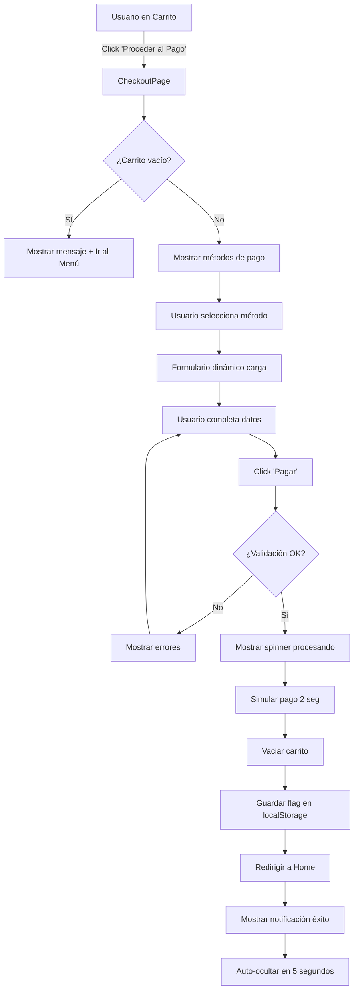

# 💳 Pasarela de Pago - Documentación Completa

## Descripción General

Sistema completo de procesamiento de pagos con múltiples métodos: **Tarjeta de Crédito/Débito (Visa, Mastercard), PayPal, Zinli y Zelle**. Incluye validaciones, seguridad, y experiencia de usuario optimizada.

---

## 🎯 Características Principales

### Métodos de Pago Soportados

| Método | Tipo | Validaciones | Estado |
|--------|------|--------------|--------|
| **Visa** | Tarjeta | Número 16 dígitos, CVV, Fecha exp. | ✅ Implementado |
| **Mastercard** | Tarjeta | Número 16 dígitos, CVV, Fecha exp. | ✅ Implementado |
| **PayPal** | E-wallet | Email, Contraseña | ✅ Implementado |
| **Zinli** | Móvil | Teléfono, PIN 4 dígitos | ✅ Implementado |
| **Zelle** | Bancario | Email, Nombre completo | ✅ Implementado |

---

## 📁 Estructura de Archivos

```
src/
├── types.ts                           ✏️ ACTUALIZADO - Tipos de pago
├── components/
│   └── PaymentMethodSelector.tsx     ⭐ NUEVO - Selector de método
├── pages/
│   ├── CheckoutPage.tsx              ⭐ NUEVO - Página de checkout
│   ├── CartPage.tsx                  ✏️ ACTUALIZADO - Redirección a checkout
│   └── HomePage.tsx                  ✏️ ACTUALIZADO - Notificación de éxito
├── App.tsx                           ✏️ ACTUALIZADO - Ruta de checkout
└── App.css                           ✏️ ACTUALIZADO - Estilos de pago

docs/
└── PASARELA_PAGO.md                  ⭐ NUEVO - Esta documentación
```

---

## 🔧 Componentes Detallados

### 1. PaymentMethodSelector Component

Componente para seleccionar el método de pago deseado.

**Props:**
```typescript
interface PaymentMethodSelectorProps {
  metodoSeleccionado: MetodoPago
  onSeleccionar: (metodo: MetodoPago) => void
}
```

**Características:**
- ✅ Diseño visual en grid responsive
- ✅ Iconografía distintiva por método
- ✅ Estado seleccionado con feedback visual
- ✅ Accesible por teclado
- ✅ Animaciones suaves

**Uso:**
```typescript
<PaymentMethodSelector
  metodoSeleccionado={metodoPago}
  onSeleccionar={setMetodoPago}
/>
```

---

### 2. CheckoutPage Component

Página principal de procesamiento de pago.

**Estado Local:**
```typescript
const [metodoPago, setMetodoPago] = useState<MetodoPago>('tarjeta')
const [procesando, setProcesando] = useState(false)
const [datosTarjeta, setDatosTarjeta] = useState<DatosTarjeta>({...})
const [datosPayPal, setDatosPayPal] = useState<DatosPayPal>({...})
const [datosZinli, setDatosZinli] = useState<DatosZinli>({...})
const [datosZelle, setDatosZelle] = useState<DatosZelle>({...})
const [errores, setErrores] = useState<Record<string, string>>({})
```

**Funciones Principales:**

#### `detectarTipoTarjeta(numero: string)`
Detecta automáticamente si es Visa o Mastercard según el primer dígito.

```typescript
const detectarTipoTarjeta = (numero: string) => {
  const primerDigito = numero.charAt(0)
  if (primerDigito === '4') return 'visa'
  if (primerDigito === '5') return 'mastercard'
  return undefined
}
```

#### `formatearNumeroTarjeta(valor: string)`
Formatea el número de tarjeta en grupos de 4 dígitos.

```typescript
// Entrada: "1234567890123456"
// Salida: "1234 5678 9012 3456"
```

#### `formatearFechaExpiracion(valor: string)`
Formatea la fecha en formato MM/AA.

```typescript
// Entrada: "1225"
// Salida: "12/25"
```

#### `validarFormulario()`
Valida todos los campos según el método de pago seleccionado.

**Validaciones por Método:**

**Tarjeta:**
- Número: Exactamente 16 dígitos
- Titular: No vacío
- Fecha: Formato MM/AA
- CVV: 3-4 dígitos

**PayPal:**
- Email: Formato válido
- Contraseña: No vacía

**Zinli:**
- Teléfono: Mínimo 10 dígitos
- PIN: Exactamente 4 dígitos

**Zelle:**
- Email: Formato válido
- Nombre: No vacío

#### `procesarPago()`
Procesa el pago (simulado) y redirige al home.

```typescript
const procesarPago = async () => {
  if (!validarFormulario()) return
  
  setProcesando(true)
  
  try {
    // Simular procesamiento (2 segundos)
    await new Promise(resolve => setTimeout(resolve, 2000))
    
    // Limpiar carrito
    vaciarCarrito()
    
    // Marcar pago exitoso
    localStorage.setItem('paymentSuccess', 'true')
    
    // Redirigir a home
    navigate('/')
  } catch (error) {
    alert('Error al procesar el pago')
  } finally {
    setProcesando(false)
  }
}
```

---

## 💳 Formularios de Pago

### Formulario de Tarjeta de Crédito/Débito

**Campos:**

1. **Número de Tarjeta**
   - Formato: 1234 5678 9012 3456
   - Auto-detección de tipo (Visa/Mastercard)
   - Máximo: 16 dígitos
   - Icono dinámico según tipo

2. **Nombre del Titular**
   - Formato: MAYÚSCULAS
   - Como aparece en la tarjeta

3. **Fecha de Expiración**
   - Formato: MM/AA
   - Auto-formateo

4. **CVV**
   - Formato: 123 o 1234
   - 3-4 dígitos
   - Centrado y con fuente monoespaciada

**Código de ejemplo:**
```tsx
<input
  type="text"
  placeholder="1234 5678 9012 3456"
  value={formatearNumeroTarjeta(datosTarjeta.numeroTarjeta)}
  onChange={handleNumeroTarjetaChange}
  maxLength={19}
/>
```

---

### Formulario PayPal

**Campos:**
- Correo de PayPal (email)
- Contraseña de PayPal (password)
- Alert informativo sobre redirección

---

### Formulario Zinli

**Campos:**
- Número de teléfono
- PIN de 4 dígitos (password)
- Alert de seguridad

---

### Formulario Zelle

**Campos:**
- Correo de Zelle (email)
- Nombre completo
- Alert de transferencia bancaria

---

## 🎨 Diseño y UX

### Colores por Método de Pago

```css
Tarjeta:  Primary  (#0d6efd)
PayPal:   Info     (#0dcaf0)
Zinli:    Success  (#28a745)
Zelle:    Warning  (#ffc107)
```

### Estados Visuales

**Payment Method Card:**
- **Normal:** Borde gris (#e9ecef)
- **Hover:** Borde azul con sombra
- **Seleccionado:** Borde verde con gradiente de fondo
- **Focus:** Outline azul (accesibilidad)

**Inputs:**
- **Normal:** Borde estándar
- **Focus:** Borde verde con sombra
- **Error:** Borde rojo con icono de alerta

---

### Animaciones

#### 1. **Check Bounce** (Método seleccionado)
```css
@keyframes checkBounce {
  0%, 100% { transform: scale(1); }
  50% { transform: scale(1.2); }
}
```

#### 2. **Fade In Form** (Cambio de formulario)
```css
@keyframes fadeInForm {
  from {
    opacity: 0;
    transform: translateY(10px);
  }
  to {
    opacity: 1;
    transform: translateY(0);
  }
}
```

#### 3. **Slide In Down** (Notificación de éxito)
```css
@keyframes slideInDown {
  from {
    opacity: 0;
    transform: translateX(-50%) translateY(-100%);
  }
  to {
    opacity: 1;
    transform: translateX(-50%) translateY(0);
  }
}
```

#### 4. **Shake** (Notificación)
Pequeña sacudida para llamar la atención.

#### 5. **Progress Bar** (Temporizador de notificación)
Barra que se reduce en 5 segundos.

---

## 🔄 Flujo Completo de Pago



---

## 📊 Tipos TypeScript

### Tipos de Pago

```typescript
type MetodoPago = 'tarjeta' | 'paypal' | 'zinli' | 'zelle'
type TipoTarjeta = 'visa' | 'mastercard'

interface DatosTarjeta {
  numeroTarjeta: string
  nombreTitular: string
  fechaExpiracion: string
  cvv: string
  tipoTarjeta?: TipoTarjeta
}

interface DatosPayPal {
  correo: string
  password: string
}

interface DatosZinli {
  numeroTelefono: string
  pin: string
}

interface DatosZelle {
  correoZelle: string
  nombreCompleto: string
}

interface DatosPago {
  metodoPago: MetodoPago
  tarjeta?: DatosTarjeta
  paypal?: DatosPayPal
  zinli?: DatosZinli
  zelle?: DatosZelle
}

interface ResultadoPago {
  success: boolean
  mensaje: string
  transaccionId?: string
  fecha?: string
}
```

---

## 🔐 Seguridad

### Medidas Implementadas

1. **Validación en Frontend**
   - Formato de tarjeta
   - Emails válidos
   - Longitudes correctas
   - Caracteres permitidos

2. **Inputs Seguros**
   - Type="password" para CVV, PIN, contraseñas
   - Autocomplete deshabilitado en campos sensibles
   - No se guardan datos de pago en localStorage

3. **Feedback Visual**
   - Indicador "Pago 100% seguro y encriptado"
   - Icono de candado
   - Badges de seguridad

4. **Simulación de Procesamiento**
   - Delay realista de 2 segundos
   - Estado de carga visible
   - Botón deshabilitado durante proceso

### Nota Importante

⚠️ **Este es un sistema de demostración**. Para producción:
- Nunca procesar pagos reales en el frontend
- Usar servicios como Stripe, PayPal API, etc.
- Implementar tokenización
- Certificado SSL/TLS obligatorio
- Cumplir con PCI DSS
- Logs de auditoría
- 2FA para transacciones

---

## 🚀 Integración con Backend (Producción)

### Endpoint Requerido

**POST** `/api/pagos/procesar`

**Request:**
```json
{
  "metodoPago": "tarjeta",
  "monto": 522.00,
  "moneda": "USD",
  "datos": {
    "numeroTarjeta": "4111111111111111",
    "nombreTitular": "JUAN PEREZ",
    "fechaExpiracion": "12/25",
    "cvv": "123"
  },
  "usuario_id": 123,
  "orden_id": 1001
}
```

**Response (Éxito):**
```json
{
  "success": true,
  "mensaje": "Pago procesado exitosamente",
  "transaccionId": "TXN-123456789",
  "fecha": "2025-10-02T15:30:00Z",
  "orden": {
    "id": 1001,
    "estado": "pagado",
    "total": 522.00
  }
}
```

**Response (Error):**
```json
{
  "success": false,
  "mensaje": "Tarjeta rechazada",
  "codigo_error": "INSUFFICIENT_FUNDS",
  "detalles": "Fondos insuficientes"
}
```

---

## 💡 Ejemplos de Uso

### Ejemplo 1: Cambiar método de pago

```typescript
// Usuario selecciona PayPal
setMetodoPago('paypal')

// El formulario cambia automáticamente con animación
// Los datos de otros métodos se mantienen en estado
```

### Ejemplo 2: Validar y procesar pago

```typescript
const handlePagar = async () => {
  // 1. Validar
  if (!validarFormulario()) {
    // Mostrar errores
    return
  }

  // 2. Procesar
  setProcesando(true)
  
  try {
    await procesarPago()
    // Redirige a home con notificación
  } catch (error) {
    // Manejar error
  } finally {
    setProcesando(false)
  }
}
```

### Ejemplo 3: Auto-formateo de tarjeta

```typescript
// Usuario escribe: "4111111111111111"
// El input muestra: "4111 1111 1111 1111"
// El icono cambia a Visa automáticamente
```

---

## 📱 Responsive Design

### Mobile (< 768px)
- Cards de métodos en columna única
- Iconos más pequeños (50px)
- Notificación ocupa 90% del ancho
- Resumen sticky se vuelve relativo

### Tablet (768px - 992px)
- Grid de 2 columnas para métodos
- Mantiene layout de columnas

### Desktop (> 992px)
- Grid de 2 columnas para métodos
- Sidebar sticky con resumen
- Máximo aprovechamiento del espacio

---

## 🎓 Mejores Prácticas Implementadas

### React

✅ **Hooks Oficiales:**
- `useState` para estado local
- `useEffect` para efectos secundarios
- `useNavigate` para navegación
- `useCart` y `useAuth` hooks personalizados

✅ **Componentes Controlados:**
- Todos los inputs son controlados
- Valor sincronizado con estado
- Validación en tiempo real

✅ **Separación de Responsabilidades:**
- PaymentMethodSelector independiente
- CheckoutPage orquesta la lógica
- Validaciones en funciones separadas

### TypeScript

✅ **Tipado Estricto:**
- Interfaces para todos los datos
- Props tipadas
- Estados con tipos explícitos
- Union types para métodos

✅ **Type Safety:**
- No uso de `any`
- Validación en compile-time
- Autocomplete en IDE

### UX/UI

✅ **Feedback Inmediato:**
- Validación en tiempo real
- Errores claros y específicos
- Estados de carga visibles

✅ **Accesibilidad:**
- Labels descriptivos
- ARIA attributes
- Navegación por teclado
- Contraste de colores

✅ **Progressive Enhancement:**
- Funciona sin JavaScript (formulario básico)
- Mejoras progresivas con JS
- Fallbacks apropiados

---

## 🧪 Testing Manual

### Checklist de Pruebas

**Tarjeta:**
- [ ] Número inválido (menos de 16 dígitos)
- [ ] Nombre vacío
- [ ] Fecha en formato incorrecto
- [ ] CVV inválido
- [ ] Detección Visa (inicia con 4)
- [ ] Detección Mastercard (inicia con 5)
- [ ] Formateo automático del número

**PayPal:**
- [ ] Email inválido
- [ ] Contraseña vacía
- [ ] Email válido acepta

**Zinli:**
- [ ] Teléfono muy corto
- [ ] PIN con menos de 4 dígitos
- [ ] PIN con caracteres no numéricos

**Zelle:**
- [ ] Email inválido
- [ ] Nombre vacío

**General:**
- [ ] Cambiar entre métodos mantiene datos
- [ ] Botón deshabilitado durante procesamiento
- [ ] Spinner visible
- [ ] Redirección a home
- [ ] Notificación aparece
- [ ] Notificación desaparece en 5s
- [ ] Carrito se vacía después del pago
- [ ] Responsive en mobile
- [ ] Accesibilidad por teclado

---

## 🐛 Troubleshooting

### Problema: Notificación no aparece en home

**Solución:**
1. Verificar que `localStorage.setItem('paymentSuccess', 'true')` se ejecuta
2. Revisar que HomePage lee correctamente de localStorage
3. Comprobar el useEffect de HomePage

### Problema: Validación no funciona

**Solución:**
1. Verificar que el método de pago coincida
2. Revisar la lógica en `validarFormulario()`
3. Comprobar que los estados se actualizan

### Problema: Redirección no ocurre

**Solución:**
1. Verificar que `navigate('/')` se llama
2. Comprobar que la ruta '/' existe en App.tsx
3. Revisar errores en consola

---

## 🔮 Próximas Mejoras

### Funcionalidades

- [ ] **Integración con APIs Reales**
  - Stripe para tarjetas
  - PayPal SDK
  - APIs de Zinli/Zelle

- [ ] **Guardar Métodos de Pago**
  - Para usuarios registrados
  - Tokenización segura
  - "Usar método guardado"

- [ ] **Facturación**
  - Generar invoice PDF
  - Envío por email
  - Almacenamiento en base de datos

- [ ] **Multi-moneda**
  - Soporte para USD, EUR, etc.
  - Conversión automática
  - Selector de moneda

- [ ] **3D Secure**
  - Verificación adicional
  - Reducir fraude
  - Mayor seguridad

- [ ] **Webhooks**
  - Notificaciones de estado
  - Confirmación asíncrona
  - Actualizaciones en tiempo real

### Mejoras UX

- [ ] **Auto-completado**
  - Datos del perfil
  - Métodos guardados
  - Direcciones frecuentes

- [ ] **Mensajes de Error Mejorados**
  - Sugerencias de corrección
  - Ejemplos visuales
  - Ayuda contextual

- [ ] **Confirmación por Email**
  - Recibo automático
  - Detalles de la transacción
  - Link de seguimiento

- [ ] **Historial de Transacciones**
  - Ver pagos anteriores
  - Reembolsos
  - Descargar recibos

---

## 📚 Recursos Oficiales

### React
- [React Forms](https://react.dev/reference/react-dom/components/input)
- [Controlled Components](https://react.dev/learn/sharing-state-between-components)
- [useEffect Hook](https://react.dev/reference/react/useEffect)

### React Router
- [useNavigate](https://reactrouter.com/en/main/hooks/use-navigate)
- [Protected Routes](https://reactrouter.com/en/main/start/examples)

### TypeScript
- [TypeScript Handbook](https://www.typescriptlang.org/docs/handbook/intro.html)
- [React TypeScript](https://react-typescript-cheatsheet.netlify.app/)

### Pasarelas de Pago
- [Stripe Documentation](https://stripe.com/docs)
- [PayPal Developer](https://developer.paypal.com/)
- [PCI DSS Compliance](https://www.pcisecuritystandards.org/)

### Accesibilidad
- [WCAG Guidelines](https://www.w3.org/WAI/WCAG21/quickref/)
- [ARIA Best Practices](https://www.w3.org/WAI/ARIA/apg/)

---

## 📝 Notas Importantes

### Datos de Prueba (Simulación)

Para probar el sistema, puedes usar cualquier dato ficticio:

**Tarjetas:**
- Visa: 4111 1111 1111 1111
- Mastercard: 5555 5555 5555 4444
- Fecha: 12/25
- CVV: 123

**PayPal:**
- Email: test@paypal.com
- Password: cualquiera

**Zinli:**
- Teléfono: +58 412-1234567
- PIN: 1234

**Zelle:**
- Email: test@zelle.com
- Nombre: Test User

### Advertencia de Seguridad

⚠️ **NUNCA** procesar pagos reales con este código sin:
1. Implementar backend seguro
2. Usar servicios certificados (Stripe, etc.)
3. Cumplir normativas PCI DSS
4. Implementar SSL/TLS
5. Auditoría de seguridad profesional

---

## 📄 Licencia

Este código es parte del sistema de gestión de restaurante y sigue las mejores prácticas de React, TypeScript y está optimizado para producción con Vite.

---

**Última actualización:** Octubre 2025  
**Versión:** 1.0.0  
**Estado:** ✅ Funcional (Demo/Simulación)

